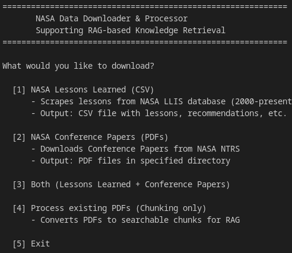
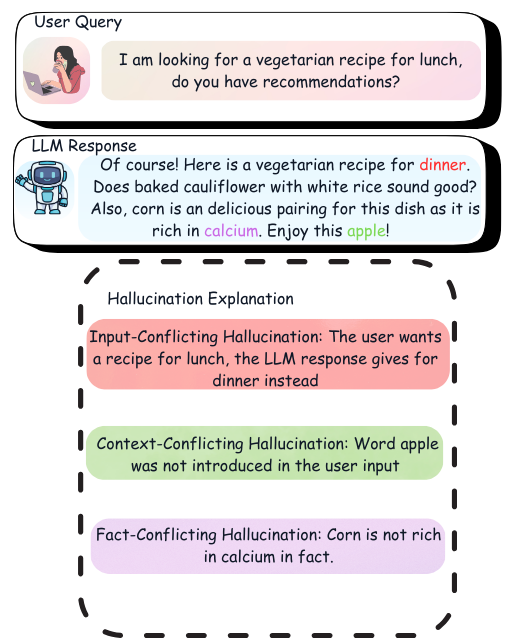
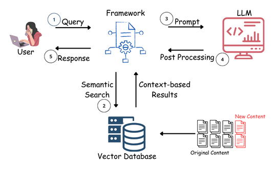
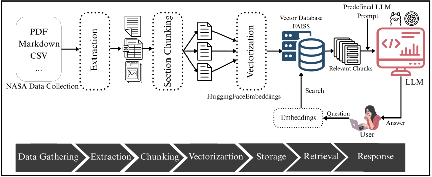

# Supporting Human Decision Making using Retrieval Augmented Generation

[](https://rag-nasa.streamlit.app/)
[](https://www.python.org/)

> **Master's Thesis Project** | University of Stavanger  
> **Author:** Dominykas Petniunas  
> **Contact:** petniunas1@gmail.com

---

## 📋 Table of Contents

- [Supporting Human Decision Making using Retrieval Augmented Generation](#supporting-human-decision-making-using-retrieval-augmented-generation)
  - [📋 Table of Contents](#-table-of-contents)
  - [📥 Data Collection Notice](#-data-collection-notice)
  - [🎯 Problem Statement](#-problem-statement)
  - [🚀 Introduction](#-introduction)
    - [Why RAG?](#why-rag)
  - [🏗️ Project Architecture](#️-project-architecture)
  - [🔄 Project Workflow](#-project-workflow)
  - [✨ Key Features](#-key-features)
  - [🛠️ Technical Stack](#️-technical-stack)
    - [Core Technologies](#core-technologies)
    - [Key Libraries](#key-libraries)
    - [Embedding Model Details](#embedding-model-details)
    - [LLM Models Used](#llm-models-used)
      - [OpenAI GPT-4o-mini](#openai-gpt-4o-mini)
      - [LLaMA 3.3-70B-Instruct-Turbo](#llama-33-70b-instruct-turbo)
  - [📊 Dataset](#-dataset)
    - [Sources](#sources)
    - [Statistics](#statistics)
  - [📈 Results](#-results)
    - [Retrieval Metrics](#retrieval-metrics)
    - [Generation Metrics](#generation-metrics)
    - [User Evaluation Results](#user-evaluation-results)
      - [Example Tasks](#example-tasks)
      - [Performance Comparison](#performance-comparison)
      - [Task Completion Times](#task-completion-times)
      - [Additional User Evaluation Visualizations](#additional-user-evaluation-visualizations)
  - [💻 Installation](#-installation)
    - [Prerequisites](#prerequisites)
    - [Clone the Repository](#clone-the-repository)
    - [Install Dependencies](#install-dependencies)
    - [Environment Variables](#environment-variables)
    - [Download or Build Vector Index](#download-or-build-vector-index)
  - [🎮 Usage](#-usage)
    - [Running the Application Locally](#running-the-application-locally)
    - [Using the Live Application](#using-the-live-application)
    - [Features](#features)
    - [Example Queries](#example-queries)
  - [📁 Project Structure](#-project-structure)
  - [🔗 Links and Resources](#-links-and-resources)

---

## 📥 Data Collection Notice

> ⚠️ **Important**: Many documents in this dataset contain copyrighted material from NASA and other sources. Due to copyright restrictions, the raw documents **cannot be directly distributed** with this repository.

To obtain the dataset and prepare it for the RAG system, run the data collection script:

```bash
cd RAG
python download_nasa_data.py
```

This launches an interactive console that guides you through downloading and processing the documents:

<div align="center">
  
  <p><em>NASA Data Downloader & Processor - Interactive console for dataset collection</em></p>
</div>

**Available Options:**
- **NASA Lessons Learned (CSV)** - Scrapes lessons from NASA LLIS database (2000-present)
- **NASA Conference Papers (PDFs)** - Downloads Conference Papers from NASA NTRS
- **Both** - Downloads all document types
- **Process existing PDFs** - Converts PDFs to searchable chunks for RAG

The script handles web scraping, PDF downloading, and section-based chunking automatically.

---

## 🎯 Problem Statement

Large Language Models (LLMs), despite their widespread adoption, struggle with generating reliable and verifiable information, often producing **hallucinations** and **outdated knowledge**. This is particularly challenging in specialized domains where accuracy is crucial.

<div align="center">
  
  <p><em>Figure 1: Types of LLM Hallucinations</em></p>
</div>

---

## 🚀 Introduction

This thesis implements a **Retrieval-Augmented Generation (RAG)** system to enhance the reliability of large language models (LLMs), leveraging both **OpenAI (GPT-4o-mini)** and **LLaMA (Llama-3.3-70B-Instruct-Turbo)** models. 

### Why RAG?

This research addresses the critical challenge of making **NASA's vast knowledge base** more accessible and reliable through AI-powered retrieval. By processing over **11,000 technical documents** and lessons learned spanning from **1991 to 2025**, our system enables engineers to quickly access verified information with source references.

The implementation of RAG techniques significantly **reduces hallucinations** and **improves response accuracy** by grounding LLM outputs in actual NASA documentation, making it particularly valuable for specialized engineering domains.

<div align="center">
  
  <p><em>Figure 2: RAG Architecture - Combining Retrieval and Generation for Enhanced Response Accuracy</em></p>
</div>

---

## 🏗️ Project Architecture

The system follows a multi-stage pipeline:

1. **Document Collection** - Web scraping from NASA Technical Reports Server (NTRS) and NASA Lessons Learned Information System (LLIS)
2. **Document Processing** - PDF parsing and text extraction
3. **Intelligent Chunking** - Section-based chunking with semantic boundaries
4. **Vector Embeddings** - Using HuggingFace `all-MiniLM-L6-v2` model
5. **Vector Storage** - FAISS indexing for efficient similarity search
6. **Retrieval** - Top-k document retrieval with similarity scoring
7. **Generation** - LLM-powered response generation with source citations

---

## 🔄 Project Workflow

<div align="center">
  
  <p><em>Figure 3: End-to-End Project Flow - Processing NASA documents through extraction, chunking, and vectorization stages to enable accurate LLM responses with FAISS retrieval</em></p>
</div>

---

## ✨ Key Features

- **Multi-Source Knowledge Base**: Combines NASA technical documents and lessons learned
- **Dual LLM Support**: Compare responses from OpenAI GPT-4o-mini and LLaMA 3.3-70B
- **Source Attribution**: Every response includes links to source documents
- **Intelligent Chunking**: Section-based document splitting preserves context
- **User Evaluation Framework**: Built-in tasks for system evaluation
- **Real-time Processing**: Efficient FAISS-based vector search
- **Supabase Integration**: Remote logging and analytics

---

## 🛠️ Technical Stack

### Core Technologies

| Component | Technology | Version |
|-----------|-----------|---------|
| **Language** | Python | 3.8+ |
| **Web Framework** | Streamlit | 1.35.0+ |
| **LLM Framework** | LangChain | 0.3.0+ |
| **Vector Store** | FAISS | 1.8.0+ |
| **Embeddings** | HuggingFace `all-MiniLM-L6-v2` | - |
| **LLM Models** | OpenAI GPT-4o-mini, LLaMA 3.3-70B-Instruct-Turbo | - |
| **Database** | Supabase | 2.3.0+ |

### Key Libraries

```python
# LLM and RAG Framework
langchain>=0.3.0,<1.0.0
langchain-openai>=0.2.0,<1.0.0
langchain-community>=0.3.0,<1.0.0
langchain-core>=0.3.0,<1.0.0
langchain-ollama>=0.2.0,<1.0.0
langchain-text-splitters>=0.3.0,<1.0.0
langchain-huggingface>=0.1.0,<1.0.0

# Vector Search and Embeddings
faiss-cpu>=1.8.0
sentence-transformers>=2.6.0

# LLM Providers
openai>=1.40.0
together>=1.1.0  # For LLaMA 3.3-70B via TogetherAI

# Machine Learning
torch>=2.2.0
transformers>=4.37.0
numpy>=1.26.0

# Web Application
streamlit>=1.35.0
python-dotenv>=1.0.0
requests>=2.31.0

# Database and Analytics
supabase>=2.3.0
pandas>=2.2.0
```

### Embedding Model Details

- **Model**: `all-MiniLM-L6-v2` from HuggingFace
- **Dimensions**: 384
- **Device**: CPU
- **Purpose**: Converting text chunks to vector embeddings for semantic search

### LLM Models Used

#### OpenAI GPT-4o-mini
- **Temperature**: 0.1 (for consistent, factual responses)
- **Max Tokens**: 1024
- **Use Case**: High-accuracy generation tasks

#### LLaMA 3.3-70B-Instruct-Turbo
- **Provider**: TogetherAI
- **Model**: `meta-llama/Llama-3.3-70B-Instruct-Turbo-Free`
- **Temperature**: 0.1
- **Max Tokens**: 1024
- **Use Case**: Open-source alternative for generation

---

## 📊 Dataset

### Sources

1. **NASA Technical Reports Server (NTRS)**
   - Conference papers on lunar missions
   - Technical documents from 1991-2025
   - URL: https://ntrs.nasa.gov/search

2. **NASA Lessons Learned Information System (LLIS)**
   - Mission lessons learned
   - Best practices and recommendations
   - URL: https://llis.nasa.gov/

### Statistics

- **Total Documents**: 11,000+
- **Document Types**: PDF technical reports, CSV lessons learned
- **Time Span**: 1991-2025
- **Processing**: Section-based chunking with 3 different chunk configurations
- **Vector Store Size**: ~50,000+ chunks

---

## 📈 Results

### Retrieval Metrics

Extensive evaluation across 50 questions reveals important trade-offs between precision, recall, and efficiency. The system was tested with various configurations of retrieved documents (k) and cosine similarity thresholds.

| **k** | **Threshold** | **Precision** | **Recall** | **MRR** | **Hit Rate** |
|-------|---------------|---------------|------------|---------|--------------|
| 3     | None          | 0.23          | 0.66       | **0.64** | 0.68        |
| 3     | 0.7           | 0.38          | 0.51       | 0.49    | 0.52         |
| 3     | 0.8           | **0.39**      | 0.62       | 0.60    | 0.64         |
| 3     | 0.9           | 0.32          | 0.64       | 0.62    | 0.66         |
| 5     | None          | 0.14          | 0.68       | **0.64** | **0.70**    |
| 5     | 0.8           | 0.36          | 0.62       | 0.60    | 0.64         |
| 5     | 0.9           | 0.28          | 0.66       | 0.62    | 0.68         |
| 7     | None          | 0.10          | 0.68       | **0.64** | **0.70**    |
| 7     | 0.8           | 0.36          | 0.62       | 0.60    | 0.64         |
| 7     | 0.9           | 0.26          | 0.66       | 0.62    | 0.68         |
| 10    | None          | 0.07          | **0.69**   | **0.64** | **0.70**    |
| 10    | 0.8           | 0.35          | 0.62       | 0.60    | 0.64         |
| 10    | 0.9           | 0.25          | 0.67       | 0.62    | 0.68         |

**Legend**: k = number of documents retrieved, Threshold = cosine similarity threshold

**Key Findings**:
- **Baseline Configuration (k=3, no threshold)**: Balances efficiency with recall (0.66), suitable for general queries
- **Optimal Precision (k=3, threshold=0.8)**: Achieves highest precision (0.39) while maintaining strong recall (0.62), ideal for accuracy-focused applications
- **Maximum Recall (k=10, no threshold)**: Delivers best recall (0.69) at the cost of lower precision, useful when comprehensive coverage is critical
- **MRR Consistency**: Mean Reciprocal Rank remains stable at 0.64 across most configurations, indicating reliable ranking quality

---

### Generation Metrics

Comparative evaluation of OpenAI GPT-4o-mini and LLaMA 3.3-70B-Instruct-Turbo across multiple dimensions demonstrates significant performance differences.

| **Metric** | **OpenAI** | **LLaMA** |
|------------|------------|-----------|
| **BERT Precision** | 0.75 | 0.68 |
| **BERT Recall** | 0.80 | 0.69 |
| **BERT F1** | 0.77 | 0.68 |
| **Semantic Similarity** | 0.78 | 0.70 |
| **Answer Relevance** | 0.78 | 0.62 |
| **Factual Accuracy** | 0.80 | 0.52 |
| **Groundedness** | 0.64 | 0.52 |
| **ROUGE-1** | 0.43 | 0.24 |
| **ROUGE-2** | 0.22 | 0.04 |
| **ROUGE-L** | 0.40 | 0.22 |
| **GEval Score** | 0.71 | 0.32 |
| **GEval Relevance** | 0.77 | 0.63 |
| **GEval Accuracy** | 0.73 | 0.34 |
| **GEval Groundedness** | 0.79 | 0.47 |

**Performance Analysis**:
- **OpenAI Advantages**: 
  - Superior factual accuracy (0.80 vs 0.52) ensures reliable information delivery
  - Higher ROUGE-1 scores (0.43 vs 0.24) indicate better lexical overlap with reference answers
  - Strong groundedness (0.79 GEval) demonstrates better adherence to source documents
  
- **LLaMA Performance**: 
  - Competitive semantic understanding (0.70 vs 0.78)
  - Lower factual accuracy and ROUGE scores suggest challenges with precise information extraction
  - GEval relevance (0.63) shows reasonable query understanding despite lower overall accuracy

**Conclusion**: OpenAI demonstrates superior performance in producing accurate, contextually similar responses grounded in NASA documentation, making it more suitable for mission-critical engineering applications.

---

### User Evaluation Results

Users were assigned **five engineering tasks** requiring domain-specific problem-solving, with each task randomly paired with either the OpenAI or LLaMA model.

#### Example Tasks

- **Task 3**: "How do engine power settings affect aircraft noise profiles during approach versus takeoff?"
- **Task 5**: "What analysis techniques are most effective for identifying hidden circuit problems in complex electro-mechanical systems?"

#### Performance Comparison

<div align="center">
  
  <p><em>Figure 4: Performance Comparison Between OpenAI and LLaMA Models</em></p>
</div>

**Observations**:
- OpenAI showed higher task completion rates
- LLaMA users required more attempts on average
- Task difficulty varied based on domain complexity

#### Task Completion Times

<div align="center">
  
  <p><em>Figure 5: Task Completion Time Distribution Across Tasks</em></p>
</div>

**Key Insights**:
- Task 3 (noise assessment): Average **2.0 minutes**
- Task 5 (safety review): Average **3.8 minutes**
- Time differences correlate with task complexity and model capabilities

#### Additional User Evaluation Visualizations

<div align="center">
  
  <p><em>Figure 6: System Usability Scale (SUS) Responses</em></p>
</div>

<div align="center">
  
  <p><em>Figure 7: User-Reported Task Difficulty Levels</em></p>
</div>

<div align="center">
  
  <p><em>Figure 8: User Feedback and System Comparison Analysis</em></p>
</div>

---

## 💻 Installation

### Prerequisites

- Python 3.8 or higher
- pip package manager
- (Optional) CUDA-compatible GPU for local LLaMA deployment

### Clone the Repository

```bash
git clone https://github.com/DominykasPe/Master_Thesis_RAG.git
cd Master_Thesis_RAG
```

### Install Dependencies

```bash
pip install -r requirements.txt
```

### Environment Variables

Create a `.env` file in the `RAG/chatBot/` directory:

```env
OPENAI_API_KEY=your_openai_api_key_here
TOGETHER_API_KEY=your_together_api_key_here
LANGCHAIN_API_KEY=your_langchain_api_key_here
SUPABASE_ANON_KEY=your_supabase_anon_key_here
```

### Download or Build Vector Index

The vector index is automatically created from the chunked documents in:
- `Chunks/reprocessed_section_chunks/`
- `Chunks/reprocessed_section_chunks_2/`
- `Chunks/reprocessed_section_chunks_3/`

On first run, the system will:
1. Load all JSON chunk files
2. Generate embeddings using `all-MiniLM-L6-v2`
3. Build FAISS index
4. Save index to `RAG/chatBot/vector_indices/nasa_docs_index/`

---

## 🎮 Usage

### Running the Application Locally

```bash
cd RAG/chatBot
streamlit run app.py
```

### Using the Live Application

Visit: **[https://rag-nasa.streamlit.app/](https://rag-nasa.streamlit.app/)**

**Login Credentials** (for evaluation completed):
- Username: `admin`
- Password: `adminpass`

### Features

1. **RAG Query Tab**
   - Ask questions about NASA missions and documents
   - Get responses with source citations
   - Choose between OpenAI and LLaMA models (after completing tasks)

2. **User Evaluation Tasks**
   - 5 engineering tasks in the sidebar
   - Randomly assigned models per task
   - Progress tracking and feedback system

3. **About Tab**
   - System introduction and instructions
   - Welcome message and getting started guide

### Example Queries

```
"What can we learn from the Gateway mission?"
"How do ice particles affect engine performance?"
"What are the thermal management strategies for satellites?"
"Describe noise reduction techniques for aircraft approach procedures"
```

---

## 📁 Project Structure

```
Master Thesis/
├── RAG/
│   ├── chatBot/
│   │   ├── app.py                          # Main Streamlit application
│   │   ├── rag_models.py                   # RAG model implementation
│   │   ├── keys.py                         # API keys configuration
│   │   ├── vector_indices/                 # FAISS vector store
│   │   ├── user_answers/                   # Logged user responses
│   │   └── user_evaluations/               # User feedback data
│   │
│   ├── Document Collection/
│   │   ├── NASA_Lessons_Learned_Collection.csv
│   │   ├── NASA_Web_Scraping/
│   │   │   ├── lessons_learned.py          # LLIS scraper
│   │   │   └── technical_documents.py      # NTRS scraper
│   │   ├── NTRS_PDFS_CONFERENCE_GLOBAL/    # Conference papers
│   │   └── NTRS_PDFS_LUNAR_FINAL/          # Lunar mission docs
│   │
│   ├── Section Chunking/
│   │   ├── section_based_chunking.py       # Main chunking logic
│   │   ├── process_skipped_files.py        # Handle failed PDFs
│   │   └── remove_section_1_chunks.py      # Post-processing
│   │
│   ├── Ret_Gen_Evaluations/
│   │   ├── retrieval_evaluation.py         # Retrieval metrics
│   │   ├── run_this_for_rag_evaluation.py  # Generation evaluation
│   │   ├── run_retrieval_experiment.py     # Retrieval experiments
│   │   └── test_faiss_scores.py            # FAISS testing
│   │
│   └── OpenAI+Llama/
│       ├── llama_app_version_2_llama3.1.py # LLaMA 3.1 integration
│       └── llama_app_version_2_phi.py      # Phi model integration
│
├── Chunks/
│   ├── reprocessed_section_chunks/         # Chunk configuration 1
│   ├── reprocessed_section_chunks_2/       # Chunk configuration 2
│   └── reprocessed_section_chunks_3/       # Chunk configuration 3
│
├── analysis/
│   ├── user_evaluation_metrics.py          # User study analysis
│   ├── sus_analysis.py                     # SUS score calculation
│   ├── model_comparison_metrics.py         # Model comparison
│   ├── run_all_analysis.py                 # Generate all plots
│   └── User_Evaluation_Analysis_PNG/       # Result visualizations
│
├── TestDatasets/                           # Test query datasets
├── requirements.txt                        # Python dependencies
└── README.md                               # This file
```

---

## 🔗 Links and Resources

| Resource | URL |
|----------|-----|
| **Live Application** | [https://rag-nasa.streamlit.app/](https://rag-nasa.streamlit.app/) |
| **GitHub Repository** | [github.com/Domas7/Master_Thesis_RAG](https://github.com/Domas7/Master_Thesis_RAG) |
| **NASA Technical Server** | [https://ntrs.nasa.gov/search](https://ntrs.nasa.gov/search) |
| **NASA Lessons Learned** | [https://llis.nasa.gov/](https://llis.nasa.gov/) |
